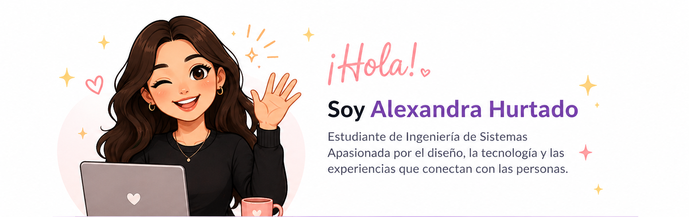
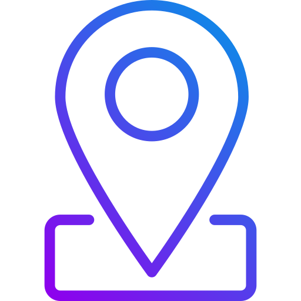
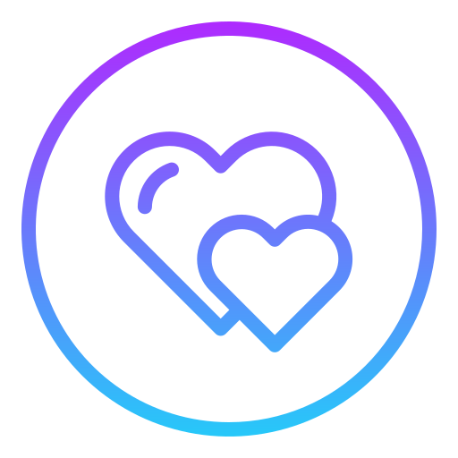
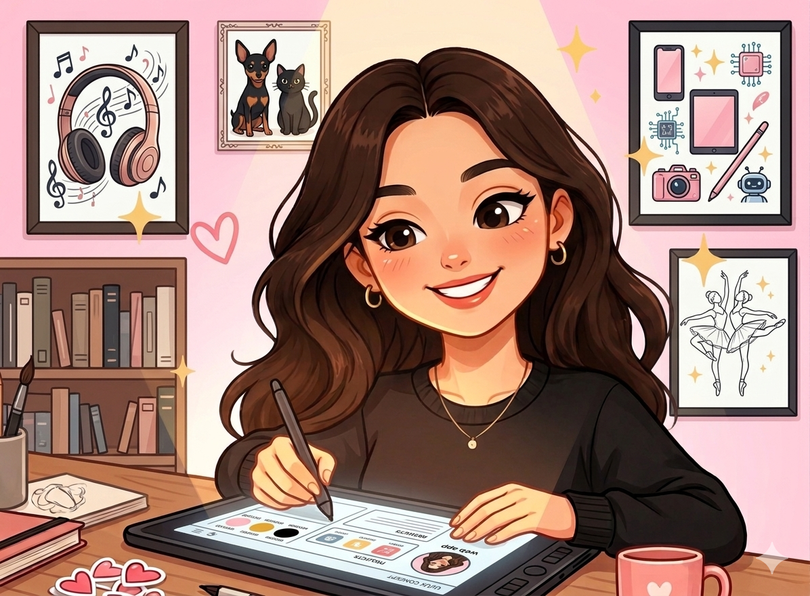

  

 

<table align="center" style="border: none;">
<tr style="border: none;">

<td align="center" style="border: none;">
   
  Medellín, Colombia
</td>

<td width="120" style="border: none;"></td>

<td align="center" style="border: none;">
   
  Estudiante en EAFIT University
</td>

<td width="120" style="border: none;"></td>

<td align="center" style="border: none;">
   
  Diseño UX/UI • Frontend • Tecnología con propósito
</td>

</tr>
</table>

# Sobre mí

<table style="border: none;">
<tr style="border: none;">

<td width="58%" valign="top" style="border: none;">

<h3>Diseño, creatividad y tecnología</h3>

Soy estudiante de Ingeniería de Sistemas en EAFIT con un gran interés por el diseño UX/UI y el desarrollo frontend. Me gusta crear soluciones que no solo funcionen bien, sino que también se sientan intuitivas, visualmente agradables y cercanas para las personas.

 

Mi objetivo es convertirme en un puente entre el diseño, la tecnología y el usuario, creando experiencias digitales que conecten genuinamente con las personas.

 

He trabajado en proyectos académicos aplicados a problemas reales, combinando desarrollo tecnológico, creatividad y trabajo en equipo.

 

Más allá de la tecnología, disfruto mucho el baile y todo lo relacionado con los procesos creativos. Me considero una persona curiosa, creativa y abierta a explorar cosas nuevas, aprender un poco de todo y experimentar constantemente con nuevas ideas.

 

Me gusta combinar creatividad, diseño y tecnología para construir experiencias más humanas, auténticas y significativas.

</td>

<td width="42%" align="center" style="border: none;">

</td>

</tr>
</table>

---

# Tecnologías

---

# Proyectos Destacados

### SafeDesk
Sistema de seguridad utilizando IoT y reconocimiento facial para monitoreo en tiempo real y protección de entornos universitarios.

### Sistema de Egresados
Sistema de información desarrollado para el Centro de Egresados de la Institución Universitaria Visión de las Américas.

### Proyecto en colaboración con Stanley Black & Decker
Participación en un proyecto colaborativo enfocado en resolver problemáticas reales mediante tecnología.

---

# Experiencia

- Desarrollo de proyectos académicos aplicados  
- Trabajo colaborativo en equipos multidisciplinarios  
- Resolución de problemas con enfoque en el usuario  
- Pensamiento creativo y orientado al diseño  

---

# GitHub Stats

  

---

# Lenguajes Más Usados

  

---

# Actualmente Explorando

---

# Conecta conmigo

  &nbsp;&nbsp;
  
  

